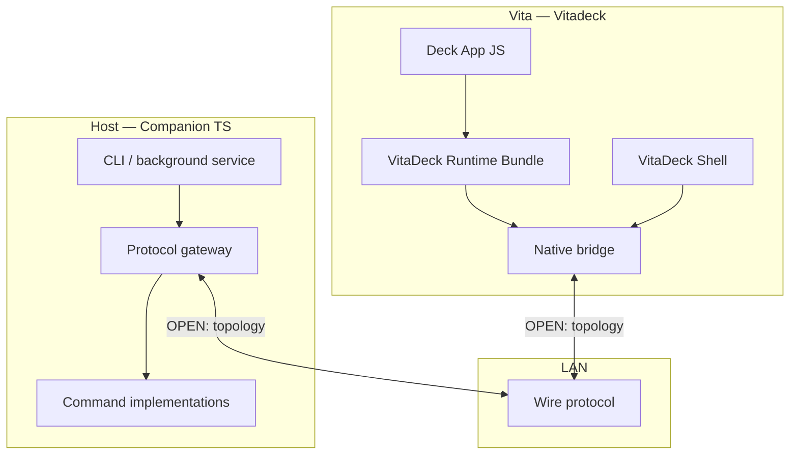

# Host Control — Architecture sketch

Status: **draft** — decisions marked **OPEN** are for grill-with-docs.

## Layers



| Layer | Owner | Responsibility |
|-------|--------|----------------|
| **Deck App** | Author | UI that triggers host actions via **VitaDeck Runtime API** |
| **SDK** | `@vitadeck/sdk` | Command registry, types, client helpers |
| **Native bridge** | Vitadeck C | Network I/O off the JS thread, settings, shell UI |
| **Companion** | New TS package | Listen or connect per topology; execute commands |
| **Contract** | Shared spec | JSON messages, errors, versioning |

## Prior branch (`host-control-companion`) — what to reuse vs drop

| Aspect | Old branch | Fresh direction (from product goals) |
|--------|------------|-------------------------------------|
| Pairing | Vita stores **host** `http://…` URL in settings | User enters **Vita** address in host app; **host initiates** link |
| Steady-state calls | Vita HTTP **client** → host HTTP server | **OPEN** — see below |
| JSON shape | `VitaDeckLanJsonResult`, `{ command, payload? }` | Likely reuse pattern; name terms in CONTEXT.md |
| Ports | Default `8797`, 10-port fallback on **host** | **OPEN** — listener may move to Vita |
| Commands | `host.capabilities`, `host.echo`, stubs | Keep registry pattern; defer implementations |
| Shell | Host URL editor on Vita | Show Vita IP/URL for host; **OPEN** screen design |

## Connection topology — **resolved: Option B**

**Decision:** Vita-as-server; host companion connects using Vita IP shown in Shell. Phase 1: **B-HTTP** (long-poll on shared LAN listener). Phase 2: optional **B-WS** after hardware spike ([vita-http-server-libraries.md](./vita-http-server-libraries.md)).

## Connection topology — options (reference)

Three families of designs:

### A. Vita-as-client (old branch)

- Host runs HTTP server; Vita saves host base URL; each command is `POST` from Vita.
- **Pros:** Host easy to firewall; matches “host executes commands.”
- **Cons:** Opposite of “type Vita IP into host”; Vita must know host address.

### B. Vita-as-server, host-as-client (pairing-aligned)

- Vita runs **Host Control Listener** (like **Runtime Upload Listener**); companion connects using displayed `http://VITA_IP:PORT/…`.
- Commands: **OPEN** — host could poll, or WebSocket for host→Vita pull of queued work, or Vita still POSTs to host on a channel opened during handshake.
- **Pros:** Matches displayed Vita IP; host “dials in.”
- **Cons:** Vita exposes another LAN service; NAT/threading on device.

### C. Hybrid handshake

- Host connects to Vita once (registration); Vita learns host callback URL or socket for subsequent command delivery.
- **Pros:** Flexible latency (persistent channel).
- **Cons:** More state on both sides; harder to explain in CONTEXT.md.

**Lifecycle (resolved):** One **LAN HTTP Listener** (shared port, path routing). Runs **continuously** for a Vitadeck session while the network allows. No Shell on/off toggle; **LAN HTTP Listener Recovery** only when network or bind fails. Shell shows **LAN HTTP URL** and status, not "start server."

**Transport (resolved):** **B-HTTP** long-poll first on the shared listener; optional **B-WS** later. Parse layer: **picohttpparser** (Vita cross-compile confirmed).

## Protocol sketch (command-agnostic)

Aligned with existing **Runtime Upload POST** JSON style:

```json
// Request (direction TBD)
{ "command": "host.capabilities", "payload": {} }

// Success
{ "ok": true, "protocolVersion": 1, "hostName": "…", "commands": ["…"] }

// Failure
{ "ok": false, "code": "unknown_command", "message": "…" }
```

Additional fields likely needed for async/persistent transports: `requestId`, `protocolVersion` on envelope.

## Type-safe SDK shape (intent)

- `defineHostControlCommands({ … })` in SDK (or shared package) defines the contract.
- Companion imports the same definitions + platform implementations.
- Deck Apps call typed helpers, e.g. `hostControl.launchApp({ path })` generated from registry — exact export path TBD.

## Security posture (initial)

- Same trust class as **Runtime Upload**: LAN-only, no crypto in v1; optional future **pairing token** (analogous to **Upload Pairing**).
- Fail closed on malformed input; size limits on bodies.

## Background host app

- Node.js CLI with `start` / `stop` or single long-running process.
- No GUI required; optional system tray later.
- Packaging: **OPEN** (npm global, standalone binary via `pkg`/`bun`, or dev-only `pnpm` script first).
