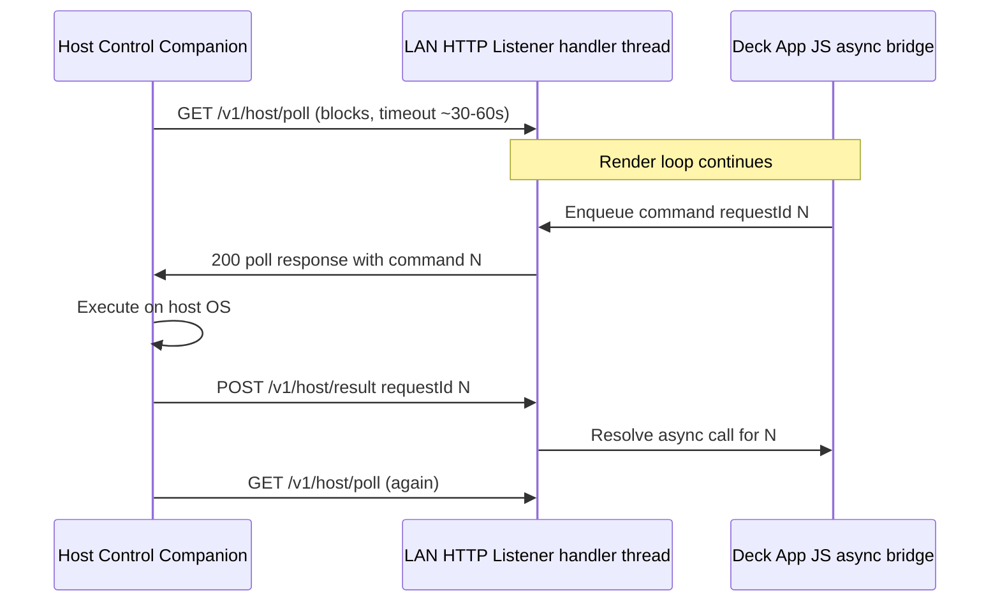

# Host Control — B-HTTP session (phase 1)

Status: **draft** (design locked for implementation).

## Pattern: Host Control Long-Poll

The **Host Control Companion** maintains a session to the **LAN HTTP URL** using blocking long-poll, not Deck App–driven polling.

## Endpoints (initial)

| Method | Path | Role |
|--------|------|------|
| `GET` | `/v1/host/poll` | Companion blocks until a command is queued or timeout |
| `POST` | `/v1/host/result` | Companion returns `VitaDeckLanJsonResult` for `requestId` |
| `GET` | `/` | **Runtime Upload Web UI** (unchanged family) |
| `POST` | `/upload` | **Runtime Upload POST** (unchanged) |

Undocumented paths: **404**. Wrong method: **405**.

Exact JSON envelopes reuse **Host Control Contract** types from `@vitadeck/sdk/host-control`.

## No UI lockup

- **Vita:** Long-poll blocking happens only inside the connection **handler thread** (clone `upload/http_server.c` model). The main loop and QuickJS never `recv` on the poll socket.
- **Deck App:** `hostControl.*` calls return promises; results arrive on a later frame via native completion drain (same class as prior `host_control.c` client bridge, but Vita is now server).
- **Companion:** Node `http`/`fetch` async client; blocking is on the companion process, not the Vita screen.

## When no companion is connected

- `GET /v1/host/poll` may return immediately with **204** or empty “no session” response, or timeout with no command—implementation detail.
- Deck App enqueue with no active poll → **Host Control Unavailable** fail-fast (no Vita-side queue in v1).

## Listener port (resolved)

- Default **8787**, consecutive fallback up to **10** attempts (8787–8796) — unchanged from **Runtime Upload**; one **LAN HTTP URL** in the **Shell LAN Strip**.

## Later

- **B-WS** may replace long-poll for latency; threading rules unchanged.
- **LAN HTTP Listener Recovery** on Vita (retry bind) remains deferred.
