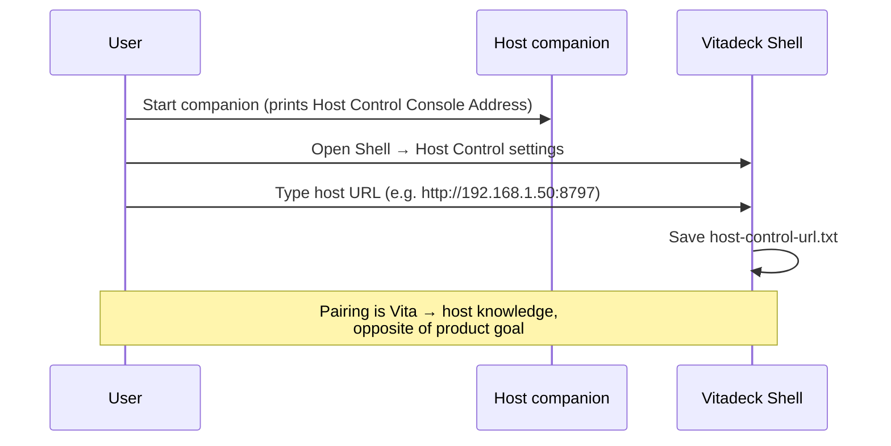
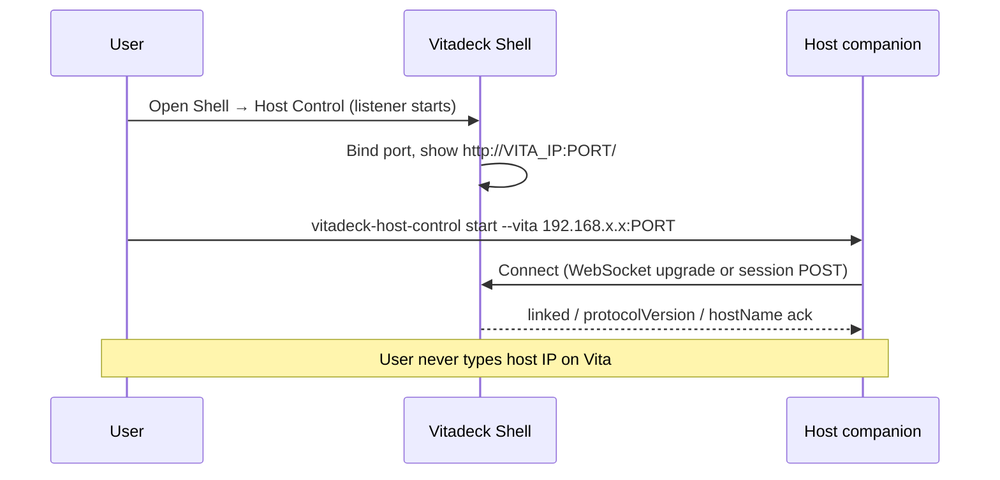
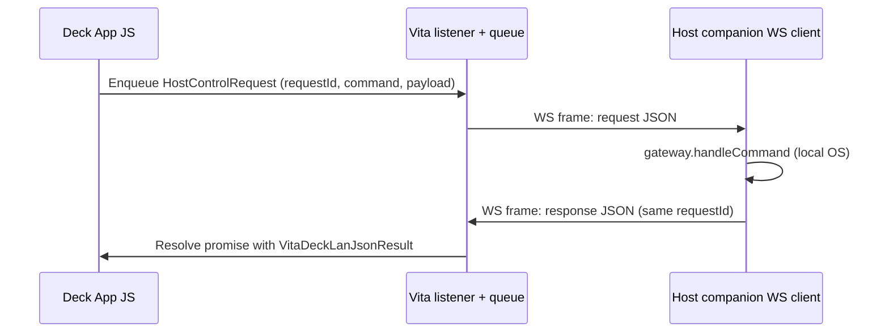
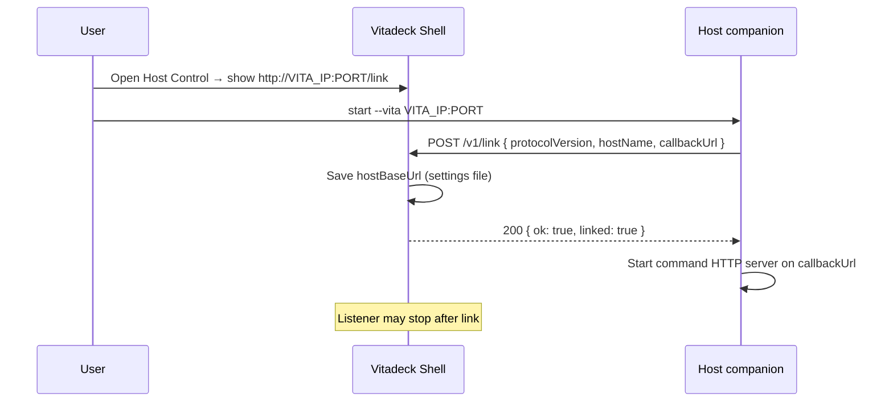
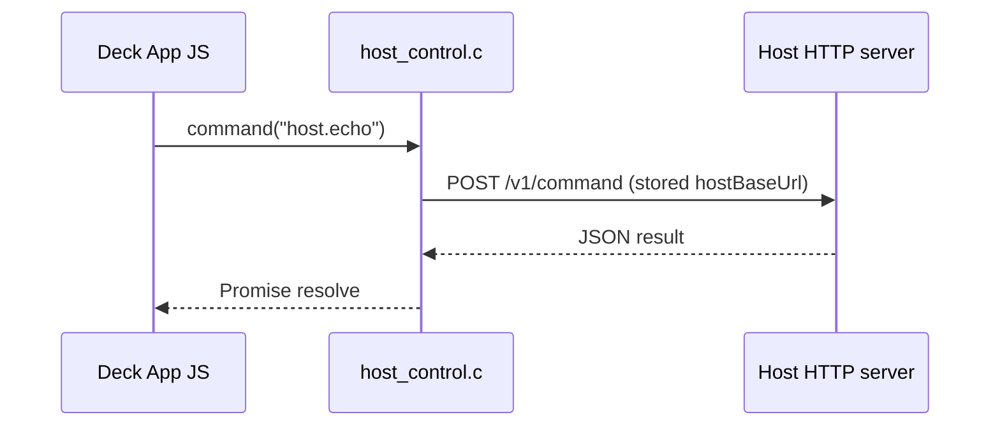

# Host Control — Connection topology comparison

Status: **analysis** (phase 0 design input). Resolves the blocking decision in [architecture-sketch.md](./architecture-sketch.md).

## Product constraints (fixed)

| Constraint | Implication |
|------------|-------------|
| User enters **Vita IP** (shown in Vitadeck) into the **host companion** | Steady-state cannot require the user to type the **host** address on the Vita as the primary pairing model |
| Low latency on home LAN | Favor **amortized connection setup** (persistent session) over per-command TCP+HTTP handshake where possible |
| Contract first, commands later | Topology choice should not block a stable `protocolVersion` + `VitaDeckLanJsonResult` envelope |
| Align with **Runtime Upload** patterns where sensible | Vita-side listener lifecycle, LAN JSON, port fallback, shell-displayed URL — not necessarily merged servers |

## Reference implementations in-repo

| Artifact | Location | Relevance |
|----------|----------|-----------|
| **Runtime Upload Listener** | `src/upload/http_server.c` | Vita `accept` + per-client handler threads, `detect_lan_ip`, ports **8787–8796**, shell URL display |
| **Prior topology A** | `origin/host-control-companion` | `host_control.c` (~620 LOC) async HTTP **client**; companion `http-server.ts`; SDK `client.ts` + registry |
| **Main branch today** | — | No Host Control native or JS yet — greenfield except upload + docs |

Default ports on old branch: host listener **8797–8806** (`HOST_CONTROL_DEFAULT_PORT`). Upload uses **8787–8796**. Separate services can coexist if lifecycle keeps at most one Vita listener per feature active, but **two simultaneous Vita listeners** both scanning the same 10-port window can collide — plan distinct defaults (e.g. Host Control **8797** on Vita when B is chosen).

---

## Option A — Vita-as-client (old `host-control-companion` model)

**Summary:** Host runs an HTTP server (`POST /v1/command`). Vita stores **host base URL** in settings. Each Deck App command is an HTTP POST from Vita → host.

### Components

| Layer | Responsibility |
|-------|----------------|
| **Vita native** | `host_control.c`: worker thread + job queue; libcurl (desktop) / `sceHttp` (Vita); `nativeHostControlFetch`; optional `nativeGetHostControlBaseUrl` from settings |
| **VitaDeck Shell** | **Host Control Address Setting** — on-screen URL editor; persists `host-control-url.txt` under package library root (old branch) |
| **JS runtime / Deck App** | `createHostControlClient()` → `command()` → native transport → `http://HOST:PORT/v1/command` |
| **SDK** | Registry (`defineHostControlCommands`), `VitaDeckLanJsonResult`, typed `command()` |
| **Host companion** | Node `http.Server` on `0.0.0.0`, port fallback 8797–8806; gateway dispatches commands |

### Pairing UX



**Steps:** (1) Start companion on PC; note LAN URL. (2) On Vita, enter that URL in Shell. (3) Deck App calls `host.capabilities` to verify.

**Mismatch with goals:** Initiation and mental model are **host-first display, Vita-first entry of host address**.

### Steady-state message flow

**One command:**

```mermaid
sequenceDiagram
  participant DA as Deck App JS
  participant RT as Runtime / SDK client
  participant NAT as host_control.c worker
  participant Host as Host HTTP server

  DA->>RT: hostControl.command("host.echo", payload)
  RT->>NAT: nativeHostControlFetch(url, body, timeout)
  NAT->>NAT: Enqueue job; worker performs POST
  NAT->>Host: POST /v1/command (new TCP connection, Connection: close)
  Host->>Host: gateway.handleCommand
  Host-->>NAT: 200 JSON VitaDeckLanJsonResult
  NAT-->>RT: Resolve promise (transport envelope)
  RT-->>DA: Parsed result / throw
```

**Rapid repeated commands:** Each call typically **opens a new HTTP connection** (companion responds with `Connection: close`). Throughput is limited by TCP setup + HTTP headers per command (~1–3 ms LAN each on a good AP, plus Vita `sceHttp` template/connection cost). No request pipelining unless added later.

### Complexity (qualitative)

| Subsystem | Effort | Notes |
|-----------|--------|-------|
| Host companion HTTP server | **Low** | Proven on branch; ~180 LOC gateway file |
| SDK + contract | **Low** | Registry + client largely portable |
| Vita HTTP client + bridge | **Medium** | ~620 LOC; Vita `sceHttp` init, queue caps (16), promise bridge |
| Shell URL editor | **Medium** | Custom character editor on branch |
| **Pairing/product fit** | **High cost to UX** | Wrong direction; rework Shell to show Vita IP instead |

### Latency

- **Connection setup:** Paid **per command** (no persistent session in old branch).
- **Per-command overhead:** HTTP request line + headers + JSON body ×2; Vita worker queue latency (usually negligible vs network).
- **Best case on LAN:** Often acceptable for occasional actions; weaker for rapid UI scrubbing (media sliders, held buttons).

### Failure modes

| Event | Behavior |
|-------|----------|
| Host sleep / companion stopped | POST fails; Deck App gets transport error |
| WiFi drop mid-request | Timeout (`sceHttp` / curl); in-flight command lost |
| Wrong host URL on Vita | Connection refused / timeout until user fixes Shell setting |
| Host port busy | Companion tries next port; **Vita setting stale** unless user updates URL |
| Companion restart on new port | Same as port busy — **Vita must be updated** |
| Vita settings cleared | `baseUrl` empty; client throws “not configured” |

### Reuse from codebase

- **High:** Entire companion gateway, SDK host-control module, `host_control.c` pattern, settings file format (if pairing model kept — **not recommended**).
- **Low:** Upload HTTP **server** code (client path is different).

### Vita-specific risks

- `sceHttp` / net module init cost on first call; 256 KiB net heap on branch.
- Worker thread + mutex: must pump completions on main/JS thread (`host_control_poll` pattern on branch).
- No extra listen port while acting as client only — **no conflict with upload port 8787**.
- Queue full (16) under burst → reject.

### Host-specific risks

- Firewall must allow **inbound** LAN TCP on companion port.
- Background service / sleep: OS may suspend process; Vita sees timeouts.
- Multiple Vitas → single listener is fine (stateless HTTP); command routing has no Vita identity unless added.

### Security surface

- LAN-trusted **inbound to host** (any peer on LAN can POST commands).
- Vita stores high-value target URL (host) — compromise of Vita settings redirects commands.
- No pairing token in v1 (same class as Runtime Upload).

### Dev/test ergonomics

- **Excellent:** `vitadeck` desktop + companion on loopback; curl host directly; Vita side optional for host-only tests.
- Old branch doc: companion prints URL → paste into Shell (desktop dev still used Vita-side URL entry).

### Future extensibility

- **Host → Vita push:** Requires **second channel** (companion cannot push over Vita-initiated POST-only model without Vita long-poll or reverse connection).
- **Bidirectional events:** Poor fit without topology change.

---

## Option B — Vita-as-server, host-as-client (pairing-aligned)

**Summary:** Vita runs a **Host Control Listener** (analogous to **Runtime Upload Listener**). User copies `http://VITA_IP:PORT/...` into the companion; **host dials in** and holds a **persistent session** (WebSocket recommended in sketch; HTTP long-poll is a simpler variant).

Below, **B-WS** = WebSocket steady-state (recommended variant in architecture-sketch). **B-HTTP** = host long-polls `GET /v1/next` on Vita (no WebSocket).

### Components

| Layer | Responsibility |
|-------|----------------|
| **Vita native** | TCP listen + port fallback; session accept; **command queue** from Deck Apps; correlate `requestId`; send results on same socket; stop/start with Shell lifecycle |
| **VitaDeck Shell** | Show **Host Control URL** when listener bound (read-only); bind-failure state like upload; entry from Shell Home (TBD) |
| **JS runtime** | Enqueue outbound host commands natively; await results by `requestId` (not HTTP client to host) |
| **SDK** | Same registry types; transport becomes “native session” not `fetch(hostUrl)` |
| **Host companion** | **Client:** connect to Vita URL; maintain WS/long-poll; dispatch to gateway; reply on wire |

### Pairing UX



**Steps:** (1) On Vita, open Host Control screen → note URL. (2) On PC, start companion with that address. (3) Optional: Deck App `host.capabilities` over established session.

### Steady-state message flow (B-WS)

**One command:**



**Rapid repeated commands:** Single TCP + TLS-free WebSocket; frames only JSON overhead. Host can process serially or with small concurrency; Vita queue drains in order unless protocol allows multiplexing.

### Steady-state (B-HTTP long-poll alternative)

Host loop: `GET /v1/session` → `GET /v1/poll` (blocks until request or timeout) → execute → `POST /v1/result`. Higher latency, simpler than WebSocket on Vita, still pairing-aligned.

### Complexity (qualitative)

| Subsystem | Effort | Notes |
|-----------|--------|-------|
| Vita HTTP listener (no WS) | **Medium** | Fork `http_server.c` patterns (~500+ LOC reference) |
| Vita WebSocket server | **High** (front-loaded) | No in-tree WS today; embed subset library or minimal RFC6455 handshake + framing |
| Vita command queue + JS bridge | **Medium** | New; mirror upload mutex/thread discipline |
| Host companion WS client | **Low–medium** | `ws` package on Node; reconnect logic |
| Shell read-only URL | **Low** | Simpler than old URL editor |
| SDK transport swap | **Medium** | Same types, different native globals |
| **Ongoing** | **Medium** | Reconnect, heartbeat, half-open detection, session auth (future) |

### Latency

- **Connection setup:** Once per session (companion start or reconnect).
- **Per-command:** WebSocket frame RTT (~0.5–2 ms LAN) + host execution; **no TCP+HTTP handshake per command**.
- **B-HTTP long-poll:** Adds poll timeout latency (trade for simpler stack).

### Failure modes

| Event | Behavior |
|-------|----------|
| Host sleep / companion stopped | Vita queue fills; commands timeout; show “host disconnected” in Shell |
| WiFi drop | WS closes; host reconnects; in-flight `requestId` need timeout/ retry policy |
| Wrong IP in companion | Connection refused; user fixes companion CLI |
| Vita port busy | Shell bind-failure (like upload); user cancels or frees port |
| Upload + Host Control both listening | Port fallback ranges may overlap — use **different default base ports** and document “one at a time” or non-overlapping ranges |
| Companion restart | Reconnect same Vita URL; Vita may reset session — **no Vita settings change** |
| Vita listener stopped (Shell cancel) | Host sees close; must not execute stale commands |

### Reuse from codebase

- **High:** `upload_server.c` — threading, `detect_lan_ip`, bind loop, handler-per-connection, JSON error helpers.
- **Medium:** Old branch gateway + registry (command execution still on host).
- **Low:** Old `host_control.c` as-is (client); logic inspiration for queue/mutex only.

### Vita-specific risks

- **Threading:** Same class as upload — accept thread + worker threads; must not block JS render thread.
- **Memory:** WS buffers + queued requests; cap queue size like upload single-flight or bounded multi-queue.
- **Firewall:** Vita exposes LAN port (user home routers usually fine).
- **sceNet / netctl:** Already used for upload IP display.
- **Port 8787:** Not required for Host Control if default is **8797** and ranges differ; risk is **simultaneous** bind attempts, not single port number.
- **WebSocket on Vita:** Largest technical unknown — may drive fallback to B-HTTP or hybrid C.

### Host-specific risks

- Firewall: **outbound** to Vita (often easier than inbound on corporate PCs).
- Background: companion should reconnect; optional launchd/Task Scheduler later.
- Multiple Vitas: companion needs `--vita` per instance or multi-session CLI; Vita listener is per-device.

### Security surface

- LAN **inbound to Vita** (session endpoint). Any LAN peer could connect unless **pairing token** added (mirror future **Upload Pairing**).
- Host is still command executor — compromised host sends malicious **results** to Vita (less scary than arbitrary OS exec on host from LAN).
- Session hijack if another host connects first — need `link token` shown on Vita screen (future).

### Dev/test ergonomics

- **Good:** Desktop Vitadeck binds listener; companion to `127.0.0.1` — matches product pairing direction.
- **Harder than A:** Need running Vita listener before companion; two-process integration test fixture.
- Contract tests: mock Vita peer in TS without native code.

### Future extensibility

- **Host → Vita push:** Natural on same WebSocket (events channel).
- **Bidirectional:** Best of three options.

---

## Option C — Hybrid handshake (register once, then Vita-as-client)

**Summary:** Host connects to Vita **once** (HTTP `POST /v1/link` or similar); Vita persists **host callback URL** (`http://HOST:PORT`). Steady-state reverts to **Option A** command path (Vita POSTs to host).

### Components

| Layer | Responsibility |
|-------|----------------|
| **Vita native** | Short-lived or on-demand **listener** for link only; HTTP client for commands (reuse `host_control.c`); persist `hostBaseUrl` |
| **VitaDeck Shell** | Show Vita URL during link mode; after link, optional “Connected to …” (host name); may hide Vita listener |
| **JS runtime / SDK** | Same as A for commands; link phase may use native one-shot |
| **Host companion** | HTTP **server** for commands + HTTP **client** for registration burst |

### Pairing UX



### Steady-state message flow

**One command:** Identical to **Option A** (Vita POST → host).



**Rapid repeated commands:** Same per-command HTTP cost as A.

### Complexity (qualitative)

| Subsystem | Effort | Notes |
|-----------|--------|-------|
| Vita link listener | **Medium** | Smaller than B-WS; can be single-endpoint HTTP |
| Vita HTTP client | **Low** | Reuse branch `host_control.c` |
| Host registration client | **Low** | One-shot fetch |
| Host command server | **Low** | Reuse branch server |
| State + UX | **Medium** | Two phases, stale `hostBaseUrl`, NAT edge cases |
| SDK | **Medium** | Link vs command transports |

### Latency

- **Pairing:** One extra host→Vita RTT at setup.
- **Steady-state:** Same as A (per-command TCP+HTTP).

### Failure modes

| Event | Behavior |
|-------|----------|
| All A failures | Apply to command phase |
| Host IP changes (DHCP) | Vita still POSTs old URL until re-link |
| Host port changes | Same |
| Link succeeds but host server fails to bind | Vita has bad callback — needs error surface |
| Re-link without clearing old URL | Ambiguous which host owns session |
| Vita listener only during link | Safer ports; user must re-open link UI to change host |

### Reuse from codebase

- **High:** `host_control.c`, companion server, registration could be minimal duplicate of upload POST parsing.
- **Medium:** Upload listener for link endpoint only (subset).

### Vita-specific risks

- Listener exposure **brief** (smaller attack window than B always-on).
- Still need `sceHttp` for every command after link.
- Stale persisted host URL is the dominant support issue.

### Host-specific risks

- Same inbound firewall as A for command phase.
- Registration must advertise correct **LAN** callback URL (not `127.0.0.1` if Vita on hardware).

### Security surface

- Two attack surfaces: Vita during link, host during commands.
- Rogue host can register if link is unauthenticated — **first registrant wins** unless token on screen.

### Dev/test ergonomics

- Desktop: link via loopback, then commands to `127.0.0.1` — workable.
- Tests: split “link fixture” and “command fixture”.

### Future extensibility

- Push from host still needs Vita long-poll/WS or reverse POST.
- Hybrid can evolve to B by keeping session open after link instead of closing.

---

## Summary comparison table

| Criterion | A — Vita client | B — Vita server (persistent) | C — Hybrid |
|-----------|-----------------|------------------------------|------------|
| **Pairing matches “type Vita IP on host”** | No | Yes | Yes (link phase only) |
| **Vita Shell shows** | Host URL entry | Vita URL (read-only) | Vita URL during link |
| **Vita persists** | Host URL | Optional token only | Host callback URL |
| **Host listens (commands)** | Yes | No (executes locally) | Yes |
| **Vita listens** | No | Yes (session) | Briefly for link |
| **Steady-state per-command latency** | Higher (new HTTP) | Lower (WS/frame) | Higher (same as A) |
| **Implementation (overall)** | Low if accepting wrong UX; Medium to fix UX | Medium–High (WS front-load) | Medium |
| **Reuse old branch** | Very high | Medium (gateway/registry) | Very high |
| **Reuse upload listener** | Low | High | Medium |
| **Host→Vita push** | Poor | Excellent | Poor |
| **Firewall friendliness (host)** | Inbound required | Outbound to Vita | Inbound required |
| **Wrong-IP recovery** | Fix on Vita | Fix on host | Re-link on host |
| **Multi-Vita** | Easy (stateless host) | One session per Vita IP | Per-Vita stored URL |
| **Port clash with upload 8787** | N/A (Vita client) | Plan separate range | Link-only listener |

---

## Is option B “much more complex”?

**Short answer:** B is **front-loaded** complexity on the **Vita network stack**, not necessarily higher **ongoing** application complexity than A+C combined.

| Dimension | A | B | C |
|-----------|---|---|---|
| **Largest new chunk** | Wrong UX / Shell editor | Vita listener + WS (or long-poll) | Two protocols + persisted state |
| **Host TS** | Simple server | WS client + reconnect | Server + one-shot client |
| **Vita C** | HTTP client (done on branch) | Listener + queue + session | Listener + client |
| **Lines of code (rough)** | ~1k portable today | +500–800 listener; +300–1500 WS depending on approach | +200 link + ~1k A |
| **Conceptual count for users** | “Two URLs” (Vita shows IP for upload, host URL for control) | “One URL on Vita for control” | “Link once, then invisible” |
| **Operational moving parts** | Host port + Vita setting | Vita port + companion args | Host port + Vita stored host |

**B without WebSocket (B-HTTP long-poll):** Drops Vita WS risk to **medium**, closer to upload server familiarity, latency between A and B-WS.

**Ongoing maintenance:** B-WS shifts effort to **session lifecycle** (reconnect, heartbeat, version negotiation). A shifts effort to **support** (“I changed WiFi / companion port”). C carries **both** link state and per-command HTTP.

---

## Recommendation

### Primary recommendation: **Option B** with a staged transport

1. **Phase 0 lock:** Pairing = Vita displays **Host Control URL**; companion `start --vita HOST:PORT` initiates session.
2. **Phase 1 transport:** Implement **B-HTTP** first (listener derived from `upload/http_server.c`, host long-poll or blocking GET for requests) to validate queue + `requestId` + gateway without WebSocket.
3. **Phase 2:** Upgrade to **B-WS** if profiling shows long-poll latency insufficient for interactive Deck Apps.

**Why not A as shipped:** Product goal explicitly rejects Vita-side host URL entry as primary pairing; keeping A requires a permanent Shell editor and splits user attention (upload URL vs host URL).

**Why not C as default:** Delivers pairing UX but **steady-state latency and firewall** match A; adds link protocol, stale callback URLs, and dual-mode documentation. C is a strong **fallback** if Vita WS proves too costly: *“host links once, returns `hostBaseUrl`, listener stops”* — documented as **C-min** in ADR terms only if needed, not first ship.

### Trade-offs to accept with B

- **Up-front:** Vita listener + session code (mitigate by cloning upload patterns).
- **LAN exposure on Vita** while Host Control mode active (same trust as Runtime Upload).
- **Companion must stay running** and reconnect (document for host users).

### Trade-offs avoided vs A/C

- No host URL typing on Vita.
- Better path to **host-pushed events** (media now playing, launch failures).
- Lower per-command overhead at scale.

### If the team caps Vita native risk

Choose **C-min** (link via Vita listener → persist host URL → commands as A) **only** as a time-boxed milestone, with a tracked migration to B-WS. Do not treat C as the long-term architecture if push/latency goals stand.

---

## Appendix — Port and lifecycle notes

- **Runtime Upload Listener:** default **8787**, 10 tries, shell-gated lifecycle ([CONTEXT.md](../../CONTEXT.md)).
- **Proposed Host Control Listener (B):** default **8797** (or **8807** if upload and host may run concurrently), same 10-try pattern, shell-gated **Host Control screen** (exact shell flow TBD in grill-with-docs).
- **Old branch host server (A):** **8797–8806** on **host** — do not assume the same port on Vita without an explicit decision.

---

## Related documents

- [overview.md](./overview.md)
- [architecture-sketch.md](./architecture-sketch.md)
- [implementation-phases.md](./implementation-phases.md)
- Prior branch reference: `origin/host-control-companion` (topology A only)
