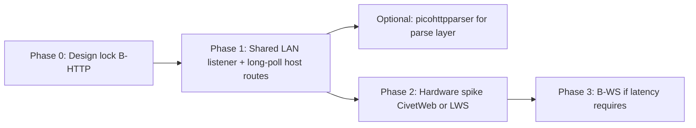

# Vita HTTP server libraries — research for Host Control (Option B)

Status: **research** (May 2026). Supports the Host Control **Vita-as-server** topology ([topology-comparison.md](./topology-comparison.md)). No code changes — library and integration options only.

## Executive summary

- **No HTTP server library is packaged or proven in VITASDK today.** Official samples and `vitasdk/packages` cover **HTTP clients** (`sceHttp`, libcurl, BSD sockets). Vita homebrew that **listens** on the LAN (FTP, static HTTP, gamepad bridges) uses **custom protocol code on `sceNet*` / BSD sockets**, not third-party HTTP stacks.
- Vitadeck already ships a **working Vita HTTP listener** for Runtime Upload (`src/upload/http_server.c`, ~585 LOC): accept thread, per-client `vd_thread` handlers, manual HTTP/1.1, ports 8787–8796.
- For **Phase 1 (B-HTTP long-poll)**, the lowest-risk path is to **extract and extend the existing upload listener** into a shared LAN HTTP module (route multiplexing for `/upload` + `/v1/*`), not to port CivetWeb/MHD first.
- For **Phase 2 (B-WS)**, **CivetWeb** (MIT, optional WebSocket, embeddable) and **libwebsockets** (MIT, HTTP/1 + WS, CMake cross-build) are the best **library** candidates — but both require a **hardware spike** (pthread/threading, RAM, binary size). Neither has a known public Vita homebrew port.
- **Sony `sceHttp` is client-only**; there is no firmware HTTP server API. Server work always sits on sockets + your own (or library) HTTP/WS framing.

---

## 1. In-repo context

### 1.1 Runtime Upload Listener (`src/upload/http_server.c`)

| Aspect | Detail |
|--------|--------|
| **Role** | Shell-gated **Runtime Upload Listener**: serves a minimal upload HTML page (`GET /`), accepts zip/multipart uploads (`POST /upload`), returns JSON. |
| **Transport** | HTTP/1.1, `Connection: close`, no TLS, no WebSocket, no keep-alive reuse. |
| **Sockets** | BSD API (`socket`, `bind`, `listen`, `accept`, `recv`, `send`) — on Vita this goes through newlib + `SceNet_stub` (same pattern as `vitasdk/samples/net_http_bsd`). |
| **Threading** | One **accept loop** thread (`server_thread`) + **one handler thread per connection** (`handler_thread`), capped at `VD_UPLOAD_MAX_OPEN_CLIENTS` (16). Uses `vd_thread` / `vd_mutex` from `src/platform/thread.h`. |
| **Vita threads** | `thread_vita.c`: `sceKernelCreateThread`, **256 KiB stack** per thread (`JS_THREAD_STACK_SIZE`). |
| **Desktop threads** | `thread_posix.c`: `pthread_create`. |
| **LAN IP** | `detect_lan_ip()`: `sceNetCtlInetGetInfo` on Vita; `getifaddrs` on desktop. |
| **Ports** | Default **8787**, up to **10** consecutive tries (8787–8796). |
| **Parsing** | Hand-rolled: peek first KB, `sscanf` method/path, read headers until `\r\n\r\n`, `Content-Length` body read (max 16 MiB), multipart boundary extraction for `archive` field. |
| **Concurrency** | Single-flight upload via `ingesting` mutex flag (409 if busy). |
| **Dependencies** | `upload/archive.h`, `package_library`, platform threads only — **no HTTP library**. |

Public API: `src/upload/http_server.h` (`VdUploadServer`, start/stop/url/success helpers).

### 1.2 Build / link (`CMakeLists.txt`)

| Target | Notes |
|--------|--------|
| **Vita** | `$ENV{VITASDK}` → `vita.toolchain.cmake`, `-O3`, links raylib/SDL2/vitaGL, QuickJS, **OpenSSL**, **libcurl**, **`SceNet_stub`**, **`SceNetCtl_stub`**, **`SceHttp_stub`**, **`SceSsl_stub`**, etc. |
| **Desktop** | raylib, libcurl, OpenSSL, **pthread**. |
| **Shared sources** | `src/upload/http_server.c` built for **both** targets; platform threading selected by `#ifdef __vita__`. |

There is **no** vendored HTTP server library in-tree today.

### 1.3 Prior Host Control on `origin/host-control-companion` (`host_control.c`)

| Aspect | Detail |
|--------|--------|
| **Topology** | **Option A** — Vita as **HTTP client**, not server (~619 LOC). |
| **Vita transport** | Worker thread + job queue (cap 16); **`sceHttp`** POST to host `POST /v1/command`; desktop uses **libcurl**. |
| **Not reusable for B** | Client stack only; pairing model (Vita stores host URL) is rejected in [topology-comparison.md](./topology-comparison.md). |
| **Reusable patterns** | Queue + mutex + `request_id` + main-thread completion drain — applicable to B’s command queue, independent of HTTP library choice. |

### 1.4 Topology doc alignment

- **Recommended path:** Option **B**, staged: **B-HTTP long-poll first**, optional **B-WS** later ([topology-comparison.md](./topology-comparison.md) § Recommendation).
- **Host Control ports (proposed):** default **8797** (or non-overlapping range vs upload 8787–8796) when both features could bind concurrently.
- **Reuse:** High for upload listener patterns; medium for old branch gateway/registry on the host.

---

## 2. Vita / homebrew ecosystem

### 2.1 Sony SDK: no server-side HTTP

| API | Server? | Notes |
|-----|---------|--------|
| **`sceHttp`** | **No** | Client only: template, connection, request, send, read ([vitasdk samples `net_http`](https://github.com/vitasdk/samples/blob/master/net_http/src/main.c)). |
| **`sceNet` / BSD sockets** | **Yes (TCP)** | Listen/accept/send/recv — foundation for all Vita listeners. |
| **`sceSsl`** | Client TLS | Used with `sceHttp` HTTPS client samples. |

There are **no community “sceHttp server” wrappers** in vitasdk headers or samples.

### 2.2 VITASDK packages (`vitasdk/packages`)

Relevant packaged libraries (as of repo browse):

| Package | Relevance |
|---------|-----------|
| **curl** | HTTP **client** (Vitadeck already links it on Vita). |
| **openssl** | TLS/crypto (client + would support HTTPS servers if ported). |
| **zlib**, **libwebp**, etc. | Not HTTP servers. |

**Not found in vitasdk/packages:** civetweb, mongoose, libmicrohttpd, libwebsockets, noPoll, uhttpd, picohttpparser.

Porting any of these means: **vendor submodule + CMake static lib + VITABUILD** (optional upstream contribution).

### 2.3 How Vita homebrew does “servers” today

| Project | Protocol | Stack | Library? |
|---------|----------|-------|----------|
| **[xerpi/libftpvita](https://github.com/xerpi/libftpvita)** | FTP | `sceNetSocket` / `sceNetAccept`, per-client `sceKernel` threads | **Custom** (~1000+ LOC FTP grammar) |
| **[Princess-of-Sleeping/PSP2-HTTP-Server](https://github.com/Princess-of-Sleeping/PSP2-HTTP-Server)** | HTTP/1.x (GET, static files) | `sceNet*` + manual response templates; `sceHttpUriUnescape` for paths only | **Custom** (~16K LOC main, not a reusable lib) |
| **[Rinnegatamante/VitaPad](https://github.com/Rinnegatamante/VitaPad)** | Binary gamepad | `sceNetListen` / `accept` | **Custom** |
| **Vitadeck Runtime Upload** | HTTP/1.1 (POST upload + HTML) | BSD `socket()` + `vd_thread` | **Custom** |
| **VitaShell FTP** | FTP | libftpvita-style patterns | **Custom** |

**Pattern:** Vita homebrew **does not** standardize on CivetWeb/MHD/Mongoose. Maintainers implement **line-oriented or minimal HTTP** on sockets when they need HTTP at all.

### 2.4 POSIX / pthread on Vita

- Vitadeck **avoids pthread on Vita** and uses **`sceKernel` threads** via `vd_thread` (256 KiB stacks).
- VITASDK **may** expose `pthread.h` / `pthread_create` (see community ports e.g. tdlib), but threading is **not** as straightforward as desktop Linux; **`vitasdk/pthread-embedded`** exists as a LGPL fork for edge cases.
- Libraries that **require internal pthread** (CivetWeb, libmicrohttpd thread pool, PJO2 uhttpd) need a **Vita hardware compile test** and possibly `USE_STACK_SIZE` / thread-count limits.

### 2.5 ESP-IDF `esp_http_server`

Espressif’s pattern (httpd on lwIP, URI handlers, optional WS) is **not portable** to Vita without replacing the entire network stack. Treat as **design reference only**, not a candidate port.

---

## 3. Candidate libraries (8)

Feasibility legend: **Vita-proven** = shipped homebrew on real hardware using this library as HTTP server; **none listed below meet that bar**.

---

### 3.1 CivetWeb

| Field | Value |
|-------|--------|
| **Name** | CivetWeb |
| **License** | MIT |
| **Repo** | https://github.com/civetweb/civetweb |
| **Vita / homebrew** | **Not ported.** Pure C, embeddable; cross-compiles to ARM in upstream docs. No desktop-only deps if built with `NO_SSL`, `NO_CGI`, `NO_LUA`, `NO_FILES`. |
| **Integration** | Git submodule under `vendor/civetweb`; static lib in CMake; compile flags e.g. `-DNO_SSL -DNO_CGI -DNO_FILES -DNDEBUG`; optional `-DUSE_WEBSOCKET` for phase 2. |
| **Threading** | Internal **pthread worker pool** by default; configurable `USE_STACK_SIZE`. **Mismatch** with Vitadeck’s `vd_thread` unless you (a) rely on Vita pthread, or (b) use external poll mode / custom worker integration (more work). |
| **WebSocket** | **Yes** (`USE_WEBSOCKET`) — RFC6455 server in same process. |
| **Footprint** | Single amalgamated `.c` can be large (**~100–300+ KiB .text** depending on flags); RAM scales with connection count and buffers. Trim with `NO_*` flags ([Building.md](https://github.com/civetweb/civetweb/blob/master/docs/Building.md)). |
| **Pros for Host Control** | Route handlers (`mg_set_request_handler`) map cleanly to `/v1/session`, `/v1/poll`, `/upload`; MIT; WS upgrade path for B-WS; mature HTTP/1.1. |
| **Cons** | **Unproven on Vita**; pthread + signal assumptions; larger than Vitadeck’s custom server; long-poll/blocking handlers need care inside CivetWeb worker threads (don’t block JS thread). |
| **Maintenance risk** | **Medium** — active project, but **Vita-specific glue becomes yours** (port, thread adapter, QA on hardware). |

---

### 3.2 Mongoose (cesanta)

| Field | Value |
|-------|--------|
| **Name** | Mongoose (cesanta/mongoose) |
| **License** | **GPLv2 or commercial** |
| **Repo** | https://github.com/cesanta/mongoose |
| **Vita / homebrew** | **Not ported.** Two-file library; many embedded ARM targets upstream. |
| **Integration** | Vendor `mongoose.c` + `mongoose.h`; event-driven `mg_mgr` poll loop — fits a dedicated network thread. |
| **Threading** | **Single-threaded event loop** (no pthread pool required) — **better fit** for Vita if you poll from one `vd_thread`. |
| **WebSocket** | **Yes** (built-in). |
| **Footprint** | Advertised as compact; configurable; still larger than hand-rolled Vitadeck listener. |
| **Pros** | Excellent embedded story; event loop aligns with “one network thread + queue to JS”; WS + HTTP/1. |
| **Cons** | **License** — GPLv2/commercial is awkward for a homebrew app unless source policy is acceptable or commercial license purchased; separate codebase from CivetWeb despite shared ancestry. |
| **Maintenance risk** | **Medium–high** (license + port). |

---

### 3.3 GNU libmicrohttpd

| Field | Value |
|-------|--------|
| **Name** | GNU libmicrohttpd (MHD) |
| **License** | LGPL 2.1+ |
| **Repo** | https://www.gnu.org/software/libmicrohttpd/ |
| **Vita / homebrew** | **Not ported.** Autotools; documented **~30–40 KiB** binary on embedded targets. |
| **Integration** | Cross-compile with `--host=arm-vita-eabi` pattern; static link; configure `--with-threads=pthread` or external select mode. |
| **Threading** | Modes: internal select, thread per connection, thread pool — **pthread-centric**. External select mode could run on one Vitadeck thread with `MHD_run`. |
| **WebSocket** | **No** — HTTP/1.1 only. |
| **Footprint** | Small HTTP server core; **no WS** means a second library for B-WS. |
| **Pros** | Standards-focused HTTP/1.1; good for **B-HTTP only**; callback API for POST bodies. |
| **Cons** | Autotools port to Vita is fiddly; LGPL linking considerations; **no WS**; pthread on Vita unverified. |
| **Maintenance risk** | **Medium** — stable upstream, **high port effort** for Vita toolchain. |

---

### 3.4 libwebsockets

| Field | Value |
|-------|--------|
| **Name** | libwebsockets (LWS) |
| **License** | MIT |
| **Repo** | https://github.com/warmcat/libwebsockets |
| **Vita / homebrew** | **Not ported.** CMake cross-build; used on ARM Linux, FreeRTOS, ESP32. |
| **Integration** | Submodule + CMake `LWS_WITH_*` trims; server-only, no TLS for LAN phase 1. |
| **Threading** | Event loop; optional multi-service threads — typically **one service thread** calling `lws_service()`. |
| **WebSocket** | **Yes** — primary strength; HTTP/1 server role included. |
| **Footprint** | Highly configurable; old ARM benchmark **~20 KiB .text** server-only minimal config ([LWS build notes](https://libwebsockets.org/lws-api-doc-main/html/md_READMEs_README_build.html)) — expect **more on Vita** with newlib. |
| **Pros** | **Best WS story** among MIT options; HTTP + WS same context; CMake fits Vitadeck. |
| **Cons** | **Heavy conceptual surface** for “just upload + a few JSON routes”; overkill if phase 1 stays HTTP-only; Vita port unproven. |
| **Maintenance risk** | **Medium** — active upstream, complex API. |

---

### 3.5 noPoll

| Field | Value |
|-------|--------|
| **Name** | noPoll |
| **License** | LGPL 2.1 |
| **Repo** | https://github.com/ASPLes/nopoll |
| **Vita / homebrew** | **Not ported** (RT-Thread package exists). |
| **Integration** | Static lib; depends on **OpenSSL** for WSS (Vitadeck already has OpenSSL). |
| **Threading** | Thread-agnostic loop; you provide listen socket and poll. |
| **WebSocket** | **Yes** — **WS only**, not a full HTTP server. |
| **Footprint** | Moderate C library; not a complete HTTP stack. |
| **Pros** | Could add WS to an existing HTTP listener later. |
| **Cons** | **Does not replace** HTTP parsing/routing; LGPL; still needs Vita port. |
| **Maintenance risk** | **Medium** — niche; you’d own HTTP + noPoll WS combo. |

---

### 3.6 picohttpparser (+ Vitadeck socket layer)

| Field | Value |
|-------|--------|
| **Name** | picohttpparser (H2O) |
| **License** | MIT |
| **Repo** | https://github.com/h2o/picohttpparser |
| **Vita / homebrew** | **Trivial to compile** (2 files, no deps) — parser only, **not Vita-proven as “server”** but zero port risk. |
| **Integration** | Drop `picohttpparser.c/.h` in `vendor/`; keep `vd_thread` accept/handlers; replace hand-rolled header/method parsing. |
| **Threading** | **Yours** — same as today. |
| **WebSocket** | **No** — HTTP parse only; WS is separate. |
| **Footprint** | **Very small** (~few KiB). |
| **Pros** | Reduces maintenance of **parse bugs** (incremental parse, slowloris-aware `last_len`); keeps proven Vitadeck threading and lifecycle; MIT. |
| **Cons** | **Not a server** — still write routing, responses, body upload, long-poll yourself. |
| **Maintenance risk** | **Low** — minimal dependency; most code remains yours. |

---

### 3.7 Shared Vitadeck LAN HTTP module (refactor custom)

| Field | Value |
|-------|--------|
| **Name** | Extract `src/net/lan_http/` (or similar) from upload server |
| **License** | Project (same as Vitadeck) |
| **Repo** | In-tree |
| **Vita / homebrew** | **Proven** — Runtime Upload on Vita today. |
| **Integration** | Refactor `http_server.c` → generic listener + route table; upload and host-control register handlers. |
| **Threading** | **Same** accept + per-client `vd_thread`; known 256 KiB stacks. |
| **WebSocket** | **No** — add later via separate lib or minimal RFC6455. |
| **Footprint** | **Smallest** — only what Vitadeck needs. |
| **Pros** | **Zero port risk**; matches [topology-comparison.md](./topology-comparison.md) B-HTTP plan; one listener can **multiplex** `/`, `/upload`, `/v1/*`; desktop+Vita already work. |
| **Cons** | Maintainer still owns HTTP edge cases (chunked encoding, keep-alive, upgrades); WS not included. |
| **Maintenance risk** | **Low–medium** — bounded scope, familiar code, no third-party release churn. |

---

### 3.8 PJO2 uhttpd (single-file reference)

| Field | Value |
|-------|--------|
| **Name** | uhttpd (PJO2 single-file) |
| **License** | GPLv3 |
| **Repo** | https://github.com/PJO2/uhttpd |
| **Vita / homebrew** | **Not ported**; pthread, static file focus. |
| **Integration** | Single `.c` — hard to strip GPL contamination for mixed codebase. |
| **Threading** | Thread per connection (pthread). |
| **WebSocket** | **No** |
| **Footprint** | Small for static files. |
| **Pros** | Simple teaching example. |
| **Cons** | **GPLv3**; static-file oriented; poor match for JSON command API + multipart upload. |
| **Maintenance risk** | **High** (license + misfit). **Not recommended.** |

---

## 4. Comparison matrix

| Candidate | Vita proven | HTTP/1.1 server | WebSocket | License | Thread fit vs `vd_thread` | Est. port effort |
|-----------|-------------|-----------------|-----------|---------|---------------------------|------------------|
| **Shared Vitadeck module** | **Yes** | Manual + optional picohttpparser | No (phase 2 separate) | Project | **Native** | **Low** (refactor) |
| **picohttpparser + sockets** | Parser trivial | Partial (parser) | No | MIT | **Native** | **Low** |
| **CivetWeb** | No | Full | Optional | MIT | pthread / adapt | **Medium–high** |
| **Mongoose** | No | Full | Yes | GPLv2/commercial | Event loop + 1 vd_thread | **Medium–high** |
| **libmicrohttpd** | No | Full | No | LGPL | pthread or MHD_run | **High** |
| **libwebsockets** | No | Full | Yes | MIT | lws_service thread | **Medium–high** |
| **noPoll** | No | No | Yes | LGPL | BYO loop | **Medium** (WS add-on) |
| **PJO2 uhttpd** | No | Static files | No | GPLv3 | pthread | Not advised |

---

## 5. Migrate vs keep custom

### 5.1 What a library would **save**

| Area | Benefit |
|------|---------|
| **HTTP parsing** | Correct incremental headers, methods, versions, chunked encoding, edge cases. |
| **Routing** | URI prefix / callback registration instead of string compares. |
| **WebSocket (phase 2)** | Handshake + framing + ping/pong without writing RFC6455. |
| **Long-term maintenance** | Security and protocol fixes upstream (if you stay on releases). |

### 5.2 What it would **cost**

| Area | Cost |
|------|------|
| **Vita port spike** | Cross-compile, link, run on hardware, fix pthread/socket errno differences. |
| **Binary size / RAM** | Likely **+100 KiB–1 MiB+** flash and heap vs minimal custom (depends on library and flags). |
| **Threading integration** | Risk of **double thread models** (library workers vs `vd_thread` vs JS thread rules). |
| **Lifecycle** | Upload + Host Control shell gating must call `mg_stop` / `lws_context_destroy` cleanly. |
| **Dependency governance** | Submodule updates, CVE tracking — for a LAN-only, low-exposure listener. |

### 5.3 Can Upload + Host Control share one listener?

**Yes — all viable approaches support a single TCP port with path routing.**

| Approach | Multiplexing |
|----------|--------------|
| **Shared Vitadeck module** | Route table: `POST /upload`, `GET /v1/poll`, `POST /v1/result`, etc. One bind, one URL in Shell (or path-specific URLs). |
| **CivetWeb / MHD / Mongoose / LWS** | Register per-URI handlers on one listening port. |
| **Two listeners** | Still possible (8787 upload, 8797 host) — [topology-comparison.md](./topology-comparison.md) prefers **distinct port ranges** if both active; **one listener** reduces user confusion and port contention. |

**Recommendation:** Prefer **one shell-gated LAN listener** with route prefixes when both features can be active; keep **separate port defaults** as fallback if lifecycle requires independent start/stop.

### 5.4 Rough LOC / effort (order of magnitude)

| Task | Estimate |
|------|----------|
| Refactor upload → shared listener + host routes (B-HTTP) | **300–500 LOC** moved/new (net positive vs duplicating upload server) |
| CivetWeb/Mongoose spike on Vita hardware | **2–5 days** if pthread works; **1–2 weeks** if thread adapter needed |
| B-WS on shared custom HTTP | **+300–1500 LOC** (hand-rolled WS) vs library WS |
| B-WS via CivetWeb/LWS after spike | **+200–800 LOC** glue + queue bridge |

---

## 6. Recommendations

### 6.1 No library is clearly Vita-proven

Public Vita homebrew **does not** demonstrate CivetWeb, MHD, Mongoose, or LWS as HTTP servers. The **proven pattern** is **BSD/`sceNet` sockets + custom protocol code** (FTP, static HTTP, Vitadeck upload). Plan accordingly.

### 6.2 Top picks for Vitadeck

#### **Pick 1 (Phase 1 — B-HTTP): Refactor the existing upload listener into a shared LAN HTTP module**

- Aligns with [topology-comparison.md](./topology-comparison.md): clone upload patterns, add host long-poll routes, **no WebSocket yet**.
- **Lowest risk** on real hardware; same threading discipline; desktop loopback testing unchanged.
- Optional: embed **picohttpparser** to replace hand-rolled parse logic without adopting a full server library.

#### **Pick 2 (Phase 2 — B-WS spike): CivetWeb (minimal MIT build) *or* libwebsockets (WS-first)**

| If priority is… | Prefer… |
|-----------------|---------|
| **One library for HTTP + WS upgrade** | **CivetWeb** (`NO_SSL`, `NO_FILES`, `USE_WEBSOCKET`) |
| **Best WS semantics / event loop** | **libwebsockets** (server-only CMake trim) |
| **Avoid pthread on Vita** | **Mongoose** event loop — **only if license resolved** |

Run a **time-boxed hardware spike** before committing: bind port, `GET /`, memory after 100 requests, thread count, VPK size delta.

**Do not** block Phase 1 on this spike.

### 6.3 Suggested phasing

1. **Phase 1:** Shared listener, routes for Runtime Upload + Host Control (`/v1/session`, blocking `/v1/poll`, `/v1/result`), command queue + `requestId` bridge to JS.
2. **Optional:** Add picohttpparser during refactor if parse complexity grows.
3. **Phase 2:** Only if profiling demands it — evaluate CivetWeb vs LWS on **Vita hardware** for WebSocket steady-state.
4. **Defer:** libmicrohttpd (no WS), noPoll-only (no HTTP), PJO2 uhttpd (GPL), ESP-IDF patterns.

### 6.4 When to reconsider a full library earlier

- Team refuses to maintain **any** HTTP parsing (even with picohttpparser).
- **B-WS** is confirmed day-one requirement (not phase 2).
- Spike shows **shared custom module** cannot meet latency with long-poll and WS is mandatory immediately → prioritize **Mongoose (license)** or **CivetWeb** after spike.

---

## 7. References

### In-repo

- `src/upload/http_server.c`, `src/upload/http_server.h`
- `src/platform/thread_vita.c`, `src/platform/thread_posix.c`
- `CMakeLists.txt`
- `docs/host-control/topology-comparison.md`
- `origin/host-control-companion:src/jslib/host_control.c` (HTTP client, topology A)

### External

- [vitasdk/samples — net_http, net_http_bsd, net_libcurl](https://github.com/vitasdk/samples)
- [vitasdk/packages — curl VITABUILD](https://github.com/vitasdk/packages/tree/master/curl)
- [CivetWeb embedding](https://github.com/civetweb/civetweb/blob/master/docs/Embedding.md)
- [GNU libmicrohttpd manual](https://www.gnu.org/software/libmicrohttpd/manual/libmicrohttpd.html)
- [libwebsockets](https://libwebsockets.org/)
- [picohttpparser](https://github.com/h2o/picohttpparser)
- [PSP2-HTTP-Server](https://github.com/Princess-of-Sleeping/PSP2-HTTP-Server) (custom Vita HTTP)
- [libftpvita](https://github.com/xerpi/libftpvita) (custom Vita FTP server)

---

## Document history

| Date | Change |
|------|--------|
| 2026-05-26 | Initial research for Host Control Option B listener selection |
